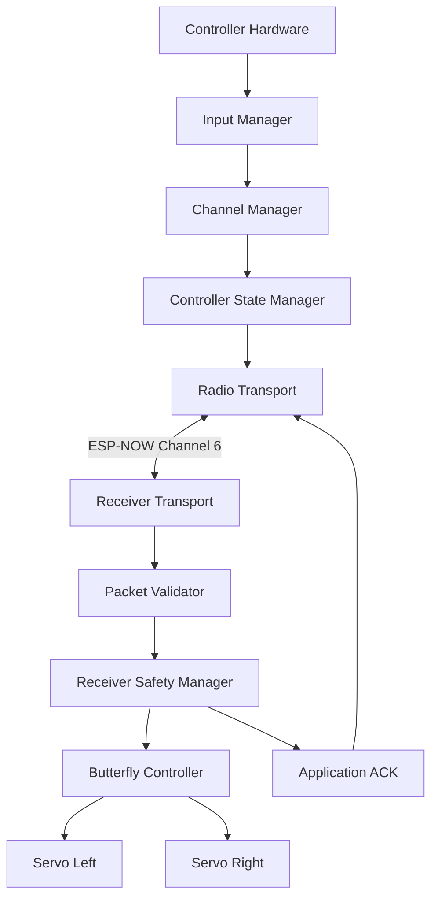

```mermaid
flowchart TD
    A[Controller Hardware] --> B[Input Manager]
    B --> C[Channel Manager]
    C --> D[Controller State Manager]
    D --> E[Radio Transport]
    E <-->|ESP-NOW Channel 6| F[Receiver Transport]
    F --> G[Packet Validator]
    G --> H[Receiver Safety Manager]
    H --> I[Butterfly Controller]
    I --> J[Servo Left]
    I --> K[Servo Right]
    H --> L[Application ACK]
    L --> E
```